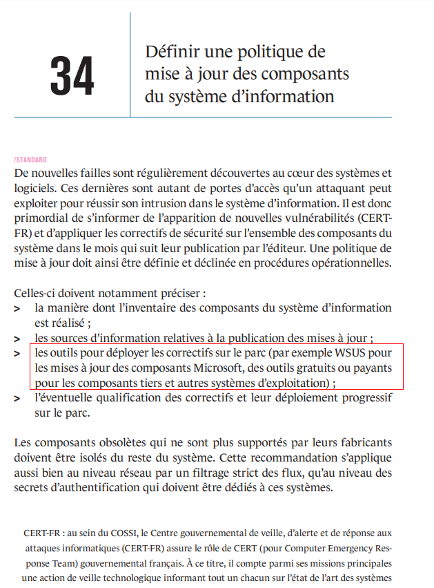

## Introduction

WSUS, ou **Windows Server Update Services**, est un service gratuit fourni par Microsoft qui permet aux administrateurs de gérer la distribution de mises à jour diffusées à travers Microsoft Update. Cet article vise à fournir une définition claire de WSUS, à expliquer son utilité, et à illustrer son rôle vital dans la cybersécurité à travers des références à des guides officiels.

## Définition de WSUS

WSUS est une fonctionnalité des systèmes d'exploitation Windows Server qui permet aux administrateurs système de gérer et de contrôler les mises à jour de Windows distribuées par Microsoft. Cela offre une plateforme centralisée pour la gestion des mises à jour au sein d'un réseau d'entreprise, permettant ainsi aux administrateurs de contrôler quelles mises à jour sont installées, quand elles sont installées et sur quels systèmes.

## Utilité de WSUS

Le principal avantage de WSUS est qu'il permet aux administrateurs de gérer efficacement les mises à jour sur de nombreux systèmes. Sans WSUS, les administrateurs système devraient individuellement mettre à jour chaque machine, un processus qui peut être à la fois chronophage et susceptible d'erreurs.

De plus, WSUS permet aux entreprises d'économiser de la bande passante. Plutôt que de permettre à chaque machine de télécharger des mises à jour directement depuis les serveurs Microsoft (ce qui peut consommer beaucoup de bande passante lorsqu'il est effectué simultanément sur de nombreux systèmes), WSUS télécharge une fois les mises à jour sur un serveur local, puis distribue ces mises à jour aux autres machines du réseau.

## WSUS et la Cybersécurité

En matière de cybersécurité, WSUS joue un rôle crucial. Les mises à jour de Windows incluent souvent des correctifs de sécurité qui visent à réparer les vulnérabilités connues. En utilisant WSUS, les administrateurs peuvent s'assurer que ces mises à jour de sécurité sont déployées rapidement et uniformément sur tous les systèmes, minimisant ainsi la fenêtre de vulnérabilité.

- **Déploiement uniforme des mises à jour de sécurité** : WSUS permet un déploiement rapide et uniforme des mises à jour de sécurité sur tous les systèmes d'une organisation.

- **Réduction de la fenêtre de vulnérabilité** : En permettant un déploiement rapide des correctifs de sécurité, WSUS aide à minimiser la durée pendant laquelle les systèmes restent vulnérables.

- **Gestion centralisée des mises à jour** : Avec WSUS, les administrateurs ont un contrôle centralisé sur les mises à jour de sécurité, leur permettant de s'assurer que tous les systèmes sont à jour.

- **Economie de la bande passante** : WSUS télécharge une fois les mises à jour sur un serveur local, puis distribue ces mises à jour aux autres machines du réseau, économisant ainsi la bande passante.

- **Les serveurs qui n'ont pas accès à internet** : Les serveurs qui n'ont pas besoin d'accès à internet n'ont pas besoin d'y avoir accès pour uniquement les mises à jour étant donné que c'est géré par le WSUS qui récupère de façon uniforme les mises à jours.

## Conclusion

En somme, WSUS est un outil essentiel pour toute organisation qui utilise des systèmes Windows dans son infrastructure. Il offre non seulement une méthode efficace et centralisée pour gérer les mises à jour de Windows, mais il joue également un rôle crucial dans la protection des systèmes contre les menaces de cybersécurité. En veillant à ce que tous les systèmes soient à jour avec les dernières mises à jour de sécurité, les administrateurs peuvent grandement améliorer la posture de sécurité de leur organisation.

## Documentation utile

- Justification d'utilisation WSUS dans le cadre Windows Server :

- Tutoriel pour mettre en place un WSUS et distribuer les mises à jours :
https://openclassrooms.com/fr/courses/2356306-prenez-en-main-windows-server/5836381-distribuez-des-mises-a-jour-avec-wsus