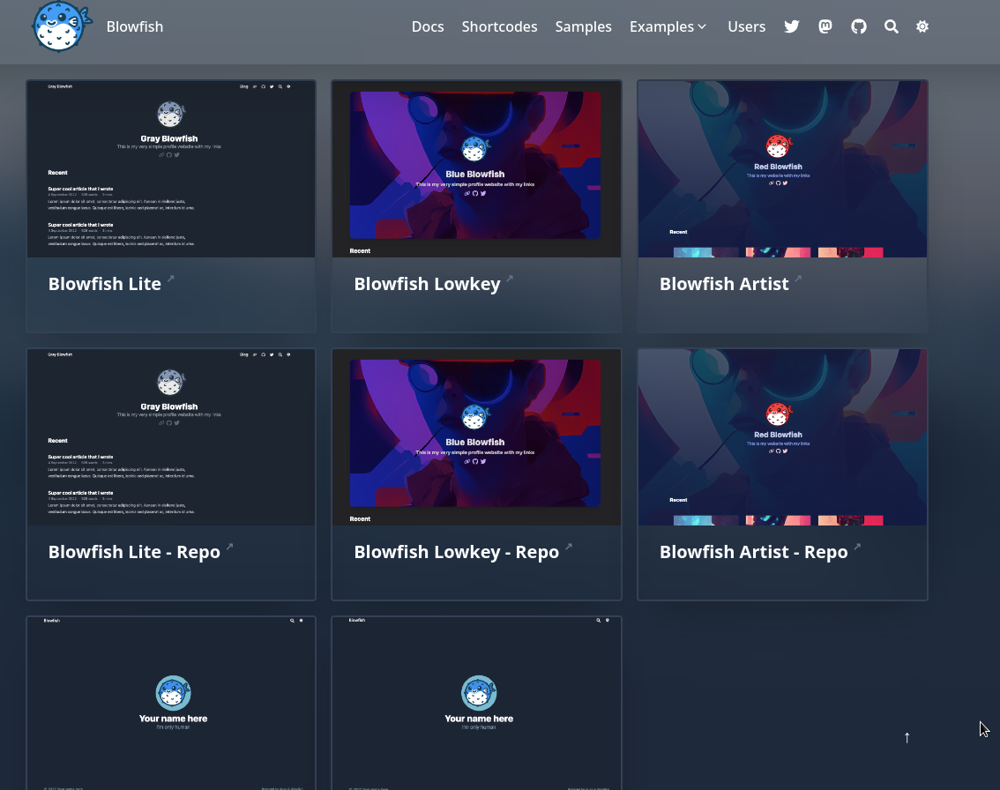
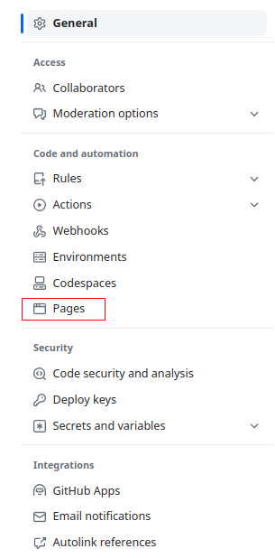
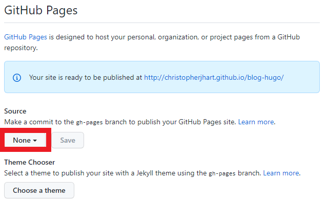
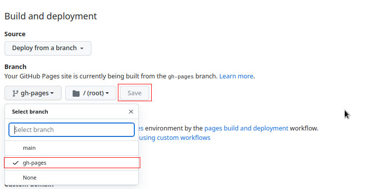
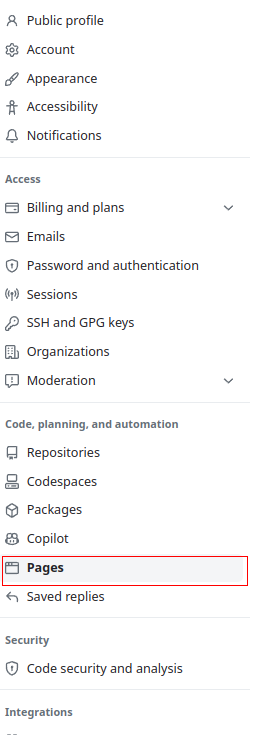
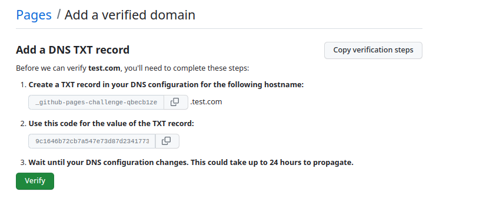
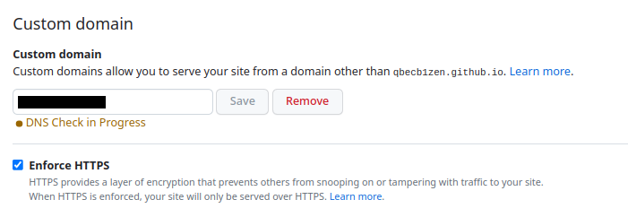

## Introduction
Créer du contenu technique est une compétence qui s'améliore avec la pratique, et une manière facile de partager ses connaissances technologiques est de créer un blog et de le partager sur Internet. Une idée fausse courante est que créer son propre site web ou blog nécessite des compétences techniques (comme de l'expérience avec les bases de données, les serveurs web, un système de gestion de contenu comme WordPress, ou des machines virtuelles) et un investissement financier (location d'une machine virtuelle auprès d'un fournisseur de cloud public ou hébergement sur son propre homelab).


Idéalement, nous avons trois objectifs lors de la création et de la maintenance d'un blog :
- Coût nul ou faible - Gratuit ou aussi proche que possible de la gratuité.
- Productivité - Facile à rédiger et à maintenir.
- Cloud Native - Utilisation de services cloud publics pour l'hébergement, permettant une mise à l'échelle infinie.

Pour le faire, j'ai décidé de choisir les éléments suivants :

- **Markdown** - Un langage de balisage extrêmement facile à lire nativement, facile à écrire et pouvant être facilement converti en HTML. Souvent maîtrisé par les personnes ayant pour objectif de créer du contenu technique.
- **Hugo** - Un générateur de sites statiques écrit en langage Go qui permet de rendre le contenu écrit en Markdown en pages HTML.
- **GitHub Pages** - Un service de GitHub qui héberge du contenu web (tel que des pages HTML) stocké dans un référentiel GitHub. Gratuit, rien de mieux pour optimiser les coûts de son blog
- **Godaddy** - Service provider qui m'a permis d'acheter mon DNS à 1€ pour la 1ère année.

Dans cet article, nous allons montrer comment créer gratuitement ton propre blog en utilisant les technologies mentionnées ci-dessus. Nous construirons notre blog en utilisant un hôte Archlinux (bien que la plupart des instructions soient réalisables sur n'importe quel système d'exploitation Linux, y compris Windows Subsystem for Linux [WSL]).

## Installation des dépendances

Il faut principalement que la CLI [Hugo](https://gohugo.io/) pour le faire sur linux :

```sh
    sudo snap install hugo --channel=extended
```

Pour les autres systèmes d'exploitation, il est recommandé de revenir vers la [documentation Hugo](https://gohugo.io/installation/).

pour vérifier que Hugo est bien installé, il suffit de lancer la commande :

```sh
    hugo help
```

Il faudra aussi par la suite *git*, donc il faut s'assurer d'en avoir un.

## Création du site Hugo

### Création initiale
Une fois hugo installé, on peut créer un nouveau blog avec Hugo grace à la commande :

```sh
    hugo new site <insérer votre nom de blog>
```

Pour tester que tout marche vous pouvez vous aider des commandes `hugo` qui permet de vérifier la configuration actuelle et `hugo server` pour lancer un serveur en hot reload pour afficher le contenu du blog.

### Ajout du thème
Il faudra installer un thème Hugo pour personaliser votre blog. Heureusement pour vous, Hugo fournit un [catalogue](https://themes.gohugo.io/) complet de différents thèmes déjà bien documentées et bien utilisées.

Une fois votre choix fait, il suffit d'installer le thème. Dans le cadre de ce tutoriel, j'utiliserai [blowfish](https://blowfish.page/) qui me parait pluôt très complet et permet de réaliser différentes configuration. (Attention, petit downside, dès qu'un outil est complet, il faut le configurer pour qu'il corresponde à tout ce qu'il permet de réaliser)

```sh
git submodule add https://github.com/nunocoracao/blowfish.git themes/blowfish
```

Une fois installé, il faudra faire différentes manipulations déjà bien détaillées dans le [guide officiel](https://blowfish.page/docs/) de blowfish, mais je présenterai quand même les principales.

D'abord, il est idéal de créer un dossier à la racine `config/_default` qui est pris par défaut par Hugo au lancement de l'application ou au build. Puis mettez dessus tous les fichiers de configuration .toml utilisées par le thème, pour le faire :

```sh
cp themes/blowfish/**/*.toml config/_default
``` 
vous aurez alors une liste de fichiers, le `config.toml` à renomer en `hugo.toml` comme il s'agit du nouveau nom du fichier de configuration de Hugo depuis la maj *0.87*.

Il faut aussi modifier sur ce fichier les éléments suivants : 

```toml
theme = "blowfish"
baseURL = "<votre_pseudo_github>.github.io"
defaultContentLanguage = "en"
defaultAppearance= "dark"
```

Les fichiers sont assez bien documentés globalement, et si vous voulez plus d'inspiration pour des modèles plus poussés pour en tirer un maximum, Blowfish fournit un [repo des exemples](https://blowfish.page/examples/) avec des liens vers les github et les configurations particulières.



### Créer votre premier article
Pour ça, c'est très simple, il suffit d'utiliser la CLI Hugo encore une fois :

```sh
hugo new posts/first-post.md
```
Et puis VOILÀ, vous pouvez déjà poster votre premier post.

## Déployer le site
Maintenant que vous êtes content de votre blog, ce serait bien de pouvoir le partager avec tout le monde.
Pour ce faire, on va utiliser les [github pages](https://pages.github.com/).

Avant de faire une quelconque manipulation, c'est important de créer un fichier `.gitignore` à la racine de votre projet avec comme contenu par exemple :

```
public/
```
Pour ne pas versionner vos builds.

Il suffit de créer un repository sur Github, idéalement pour ne pas avoir à faire du routage de nommer le repo de la forme suivante `<username_github>.github.io`. Autrement, Github va par défaut servir votre site plutôt sur le `<username_github>.github.io/<nom_du_repo>`.

Par la suite, github vous fournit les étapes pour push votre dossier déjà existant, sinon vous pouvez utiliser la suite pour le faire directement à l'entiereté du repo :

```sh
git init
git add -A
git commit -m "Initial commit"
git branch -M main
git remote add origin <origine_donnée_par_github>
git push -u origin main
```

Une fois push, plus qu'à lancer le déploiement.

Pour cela, on va utiliser les [Github Actions workflows](https://docs.github.com/en/actions/using-workflows).

Pour cela, commencez par créer un fichier de configuration :

```sh
    touch .github/workflows/deploy_gh.yml
```

Dans lequel on va ajouter le contenu suivant :

```yaml
---
name: Deploy Hugo site via GitHub Pages

on:
  push:
    branches:
      - main

permissions:
  contents: write

jobs:
  deploy:
    runs-on: ubuntu-22.04
    steps:
      - uses: actions/checkout@v2
        with:
          submodules: true
          fetch-depth: 0

      - name: Setup Hugo
        uses: peaceiris/actions-hugo@v2
        with:
          hugo-version: "latest"
          extended: true

      - name: Build
        run: hugo --minify

      - name: Deploy
        uses: peaceiris/actions-gh-pages@v3
        if: github.ref == 'refs/heads/main'
        with:
          github_token: ${{ secrets.GITHUB_TOKEN }}
          publish_dir: ./public
```

Une fois de nouveau push toutes les modifications sur le repo, vous pouvez aller vérifier que tout est réalisé comme vous le souhaitiez.




Une fois sur la partie pages, vous allez pouvoir modifier la source des github pages :


Une fois selectionné la bonne source comme indiqué sur le screen suivant : 



À partir de là, vous pouvez accéder directement à votre site depuis l'url `<identifiant_github.github.io>`

## Utiliser son propre DNS

Comme expliqué au début, j'ai opté pour [GoDaddy](https://www.godaddy.com/) pour acheter mon DNS. Du coup le tuto sera plutôt axé sur comment utiliser GoDaddy pour le blog.

### Ajouter son DNS sur son profile Github :
La première étape est d'ajouter votre DNS à votre profile Github, l'objectif est de valider que vous en êtes bien le détenteur.

Pour le faire, il faut se rendre aux **paramètres** github, puis sur la partie **Pages**



Une fois sur la bonne page, cliquer sur le "Add a verified domain" et puis suivre les étapes : 


Et de l'autre côté, il faut se rendre à sa console GoDaddy, et partir à la partie gestion du domaine puis y ajouter un record TXT avec les éléments fournis par Github comme dans l'image :


Une fois fait, il suffit de valider sur Github et le domaine est maintenant validé.

Maintenant que vous avez fait ça, il faut aussi ajouter 5 entrées DNS sur votre GoDaddy avec les éléments suivants : 

| Type  | Name | Data | TTL |
| :------: |:----:| :------: | :-----|
| A  | @ | 185.199.108.153 | 600seconds |
| A  | @ | 185.199.109.153 | 600seconds |
| A  | @ | 185.199.110.153 | 600seconds |
| A  | @ | 185.199.111.153 | 600seconds |
| CNAME  | www | `<usernamegithub>.github.io` | 1 Hour |

Il faudrait aussi ajouter à la racine de votre projet un fichier `CNAME` qui contient principalement votre nom de domaine

```
<nom_de_domaine>
```

Il reste plus qu'à commit le code et puis push.

Normalement là votre blog sera accessible depuis votre nom de domaine au bout de quelques minutes.

Et puis à la toute fin, il suffit d'activer le HTTPS (ça peut prendre jusqu'à 1h, le temps d'émettre un certificat pour le HTTPS et puis de tout configurer côté Github)



Et vous voilà, tout est configuré, il suffit d'écrire vos articles et de push et au bout de quelques minutes, tout sera sur le site automatiquement.