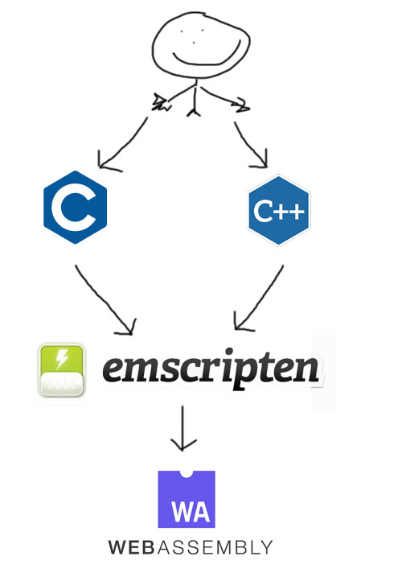

# WebAssembly (Wasm) : Exploration technique approfondie

## Introduction au WebAssembly
### Définition

WebAssembly, souvent abrégé en Wasm, est un format binaire d'instruction pour une machine virtuelle basée sur une pile. Conçu comme une cible de compilation portable pour la publication sur le web et sur les serveurs, il offre des performances proches de celles du code natif. 

WebAssembly est né de la nécessité d'exécuter du code à des vitesses proches de celles du natif dans le navigateur. Avant Wasm, JavaScript était le seul langage qui pouvait être exécuté dans le navigateur. Cependant, malgré les optimisations, il y a toujours une limite à la vitesse d'exécution de JavaScript.

*Exemple* : Pour illustrer la différence de performance, considérons une opération mathématique intensive comme la multiplication de matrices. En JavaScript, cette opération peut être 10 à 20 fois plus lente que la même opération en C ou C++ compilé en Wasm.



### Plus performant, mais pourquoi? 

La performance de Wasm provient de plusieurs facteurs:

- **Format binaire** : Contrairement à JavaScript, qui est interprété, Wasm est un format binaire, ce qui signifie qu'il est plus proche du code machine et nécessite moins de temps pour l'analyse et la compilation.
- **Typage statique** : Wasm est typé statiquement, ce qui permet des optimisations plus efficaces lors de la compilation.
- **Mémoire linéaire** : Wasm utilise une mémoire linéaire, ce qui permet un accès rapide et prévisible aux données.

*Exemple* : Dans une opération de tri d'un grand tableau, Wasm pourrait surpasser JavaScript en termes de temps d'exécution grâce à ces optimisations.

### Cas d'utilisation

- **Jeux** : Les jeux nécessitent souvent des performances élevées et une utilisation intensive de la CPU. Wasm permet d'exécuter des jeux complexes dans le navigateur à des vitesses proches de celles des applications natives.
    - **Par exemple** : `Unity`, l'un des moteurs de jeu les plus populaires, offre la possibilité d'exporter des jeux directement en WebAssembly. Cela permet aux développeurs de créer des jeux 3D complexes qui peuvent être joués dans le navigateur sans nécessiter de plugins supplémentaires.


- **Traitement d'image et vidéo** : Les opérations comme la manipulation d'image ou la compression vidéo peuvent être exécutées plus rapidement avec Wasm.
    - **Par exemple** : `Squoosh` est une application web développée par Google qui permet de compresser des images en utilisant différentes codecs et techniques. Elle utilise WebAssembly pour exécuter des codecs d'image tels que `OptiPNG` et `MozJPEG` directement dans le navigateur, offrant ainsi des performances rapides et une utilisation minimale du serveur.


- **Simulation et modélisation** : Des domaines comme la physique ou la biologie qui nécessitent des simulations complexes bénéficient des performances de Wasm.
    - **Par exemple** : `Emscripten`, un outil qui compile C et C++ en WebAssembly, a été utilisé pour porter des applications scientifiques telles que les solveurs d'équations différentielles ou les simulateurs moléculaires au navigateur. Cela permet aux chercheurs et aux étudiants d'accéder à des outils puissants directement depuis leur navigateur web.


- **Transcodage audio et vidéo** : Convertir des formats audio et vidéo en temps réel est un autre domaine où Wasm excelle.
    - **Par exemple** : `FFMpeg`, un outil populaire de traitement audio et vidéo, a été compilé en WebAssembly pour être utilisé directement dans le navigateur. Cela permet aux utilisateurs de convertir des formats audio et vidéo sans avoir à télécharger ou installer de logiciel supplémentaire.


### WebAssembly peut-il remplacer les frameworks modernes?

Wasm n'est pas conçu pour remplacer JavaScript ou les frameworks modernes, mais plutôt pour travailler avec eux. Par exemple, un framework comme React pourrait utiliser Wasm pour certaines parties intensives en calcul, tout en conservant JavaScript pour la logique de l'interface utilisateur.

Cependant, avec l'émergence de frameworks écrits spécifiquement pour **Wasm**, comme **Blazor** (en C#), il est possible que nous voyions une adoption plus large de Wasm pour le développement complet d'applications à l'avenir.


### Limitations et défis
Bien que Wasm offre de nombreux avantages, il présente également des défis. L'accès direct au DOM est actuellement limité, ce qui signifie que pour manipuler le DOM, Wasm doit passer par `JavaScript`. De plus, la gestion de la mémoire est manuelle, comme en C et C++, ce qui peut entraîner des fuites de mémoire si elle n'est pas gérée correctement, et ainsi introduire les vulnérabilités classiques sur les débordements de mémoire (BOF ou ROP).

## Structure de WebAssembly

WebAssembly est structuré autour de plusieurs concepts clés :

- **Module** : Un module Wasm est une unité binaire qui contient une collection de fonctions, de tables, de mémoires et de variables globales. Chaque module a une série d'importations et d'exportations, permettant l'interaction avec d'autres modules ou avec l'hôte (par exemple, JavaScript).
- **Mémoire** : WebAssembly utilise une mémoire linéaire, qui est un tableau d'octets adressable. Cette mémoire est partagée entre Wasm et l'hôte, permettant une interaction rapide des données. La mémoire est segmentée en pages de 64KiB.
- **Table** : Les tables sont des structures de données qui stockent des références, généralement des pointeurs vers des fonctions. Elles sont utilisées pour implémenter des choses comme les tables virtuelles et les fermetures en Wasm.
- **Fonctions** : Les fonctions en Wasm sont typées avec une signature, définissant les types d'entrée et de sortie. Elles opèrent sur une pile, avec un ensemble d'instructions pour manipuler cette pile et la mémoire linéaire.

**Exemple** : Un module Wasm simple qui exporte une fonction d'addition pourrait ressembler à ceci en pseudo-code :

```wasm
(module
    (func $add (param $a i32) (param $b i32) (result i32)
        get_local $a
        get_local $b
        i32.add)
    (export "add" (func $add))
)
```

## Compilation et exécution

### Étapes d'éxecution Wasm 
Lorsque WebAssembly est chargé dans un navigateur, plusieurs étapes se produisent :

- **Décodage** : Le bytecode Wasm est décodé en une représentation intermédiaire. Étant donné que Wasm est un format binaire, cette étape est nettement plus rapide que l'analyse syntaxique du JavaScript.
- **Validation** : Le bytecode est validé pour s'assurer qu'il est bien formé et sécurisé. Cela garantit que le bytecode ne peut pas effectuer d'opérations non sécurisées, comme accéder à la mémoire en dehors de sa plage allouée.
- **Compilation et optimisation** : Les navigateurs utilisent des techniques JIT pour compiler le bytecode en code machine. Des optimisations sont appliquées pour améliorer les performances, telles que l'élimination des redondances, l'inlining (intégration du code d'une fonction appelée directement à l'endroit de l'appel) et d'autres transformations basées sur l'analyse du flux de contrôle et des données.
- **Exécution** : Une fois compilé, le code est prêt à être exécuté. Le code Wasm s'exécute dans une sandbox pour garantir la sécurité.

### En quoi c'est plus rapide ?
Lorsque nous comparons la compilation et l'exécution de WebAssembly à celle de JavaScript, plusieurs facteurs font de WebAssembly une option plus rapide pour certaines opérations.


- **Décodage vs Analyse syntaxique** :
    - **WebAssembly** : Le format binaire de Wasm est conçu pour être décodé rapidement. Le décodage est l'action de transformer le bytecode en une représentation intermédiaire que la machine peut comprendre. Étant donné que Wasm est déjà un format bas niveau, cette étape est extrêmement rapide.
    - **JavaScript** : L'analyse syntaxique de JavaScript est une étape coûteuse. Le code source JS doit être analysé et transformé en une représentation intermédiaire avant d'être compilé. Cette analyse peut être lente, en particulier pour de grands scripts.
- **Optimisation** :
    - **WebAssembly** : Les optimisations pour Wasm sont plus prévisibles. Étant donné que Wasm est typé statiquement, le compilateur JIT peut appliquer des optimisations sans avoir à faire autant d'hypothèses sur le type de données, ce qui réduit le besoin de désoptimisations (où le compilateur doit annuler une optimisation précédente).
    - **JavaScript** : Les moteurs JS modernes utilisent des techniques JIT sophistiquées pour optimiser le code à la volée. Cependant, en raison de la nature dynamique de JavaScript, ces optimisations sont souvent basées sur des heuristiques et des suppositions. Si une supposition s'avère fausse lors de l'exécution (par exemple, un changement de type de variable), le moteur doit désoptimiser, ce qui peut entraîner des ralentissements.
- **Exécution** :
    - **WebAssembly** : Wasm opère sur une mémoire linéaire, ce qui signifie que l'accès à la mémoire est souvent plus rapide et plus prévisible. De plus, comme Wasm est un langage bas niveau, il a moins d'abstractions, ce qui peut conduire à une exécution plus rapide pour certaines opérations.
    - **JavaScript** : Bien que les moteurs JS soient hautement optimisés, l'exécution de JavaScript peut être ralentie par des facteurs tels que la gestion de la mémoire dynamique, les fermetures et les chaînes de prototypes.
- **Sécurité et sandboxing** :
    - **WebAssembly** : Wasm est conçu pour s'exécuter dans une sandbox, garantissant la sécurité. Cela signifie que, bien qu'il soit rapide, il ne compromet pas la sécurité de l'hôte.
    - **JavaScript** : JS s'exécute également dans une sandbox pour des raisons de sécurité. Cependant, en raison de sa complexité et de sa flexibilité, il y a eu des cas où des vulnérabilités ont été exploitées.

Comme on dit souvent, une image vaut mille mots :


## Interopérabilité avec JavaScript

L'interopérabilité entre WebAssembly et JavaScript est un élément essentiel de l'écosystème Web, car elle permet aux développeurs de tirer parti des avantages de chaque technologie. Ceci peut se jouer sur différents points : 

### Importation et exportation de fonctions
- **Depuis WebAssembly** : Un module Wasm peut déclarer des fonctions qu'il souhaite importer. Ces fonctions peuvent être fournies par l'environnement hôte (par exemple, le navigateur) ou par JavaScript. Lorsque le module Wasm est instancié via l'API WebAssembly de JavaScript, ces fonctions importées doivent être fournies.
- **Vers JavaScript** : De même, un module Wasm peut exporter des fonctions pour qu'elles soient utilisées par JavaScript. Une fois le module instancié, ces fonctions exportées sont accessibles comme des méthodes normales en JavaScript.

### Transfert de données
- **Mémoire** : WebAssembly utilise une mémoire linéaire, qui est essentiellement un grand tableau d'octets. Cette mémoire est accessible depuis JavaScript comme un WebAssembly.Memory object, qui expose un ArrayBuffer. Cela permet à JavaScript de lire et d'écrire directement dans la mémoire de Wasm. Pour transférer des structures de données plus complexes, comme des chaînes ou des tableaux, des conventions et des fonctions d'aide sont souvent nécessaires pour sérialiser et désérialiser les données.
- **Table** : Les tables Wasm, généralement utilisées pour stocker des références à des fonctions, peuvent également être accessibles depuis JavaScript. Cela permet des scénarios tels que le passage de callbacks ou la modification dynamique des fonctions appelées par Wasm.

### Appels synchrones et asynchrones
- **Synchrones** : Les appels entre JavaScript et Wasm sont généralement synchrones. C'est-à-dire que lorsque vous appelez une fonction Wasm depuis JavaScript, elle s'exécute immédiatement et ne retourne que lorsque l'exécution est terminée.
- **Asynchrones** : Bien que l'interaction directe soit synchronisée, des modèles asynchrones peuvent être construits en utilisant des promesses et des Web Workers en JavaScript. Par exemple, un module Wasm qui effectue un traitement intensif pourrait être exécuté dans un Web Worker pour éviter de bloquer le thread principal.


### Gestion des exceptions
WebAssembly ne supporte pas nativement les exceptions de la même manière que JavaScript. Si une erreur se produit dans le code Wasm, elle ne sera pas automatiquement propagée à JavaScript sous forme d'exception. Cependant, des conventions peuvent être mises en place pour signaler les erreurs, par exemple en utilisant des codes de retour spécifiques. Des propositions sont en cours pour ajouter un support natif des exceptions à WebAssembly, ce qui améliorera l'interopérabilité dans ce domaine.

## Langages supportés

La capacité de compiler vers Wasm s'étend à plusieurs langages :

- **C/C++** : Emscripten est l'outil le plus populaire pour compiler du C/C++ en Wasm. Il fournit une émulation complète de certaines parties de la libc, ainsi qu'une intégration avec WebGL et WebAudio pour les applications graphiques et audio.
- **Rust** : Rust a un support intégré pour Wasm. Le compilateur Rust, rustc, peut cibler Wasm directement, et des outils tels que wasm-bindgen permettent une interopérabilité facile avec JavaScript.
- **AssemblyScript** : C'est essentiellement TypeScript avec des types stricts, compilé en Wasm. Il offre une syntaxe familière pour les développeurs JavaScript tout en produisant du bytecode Wasm optimisé.

